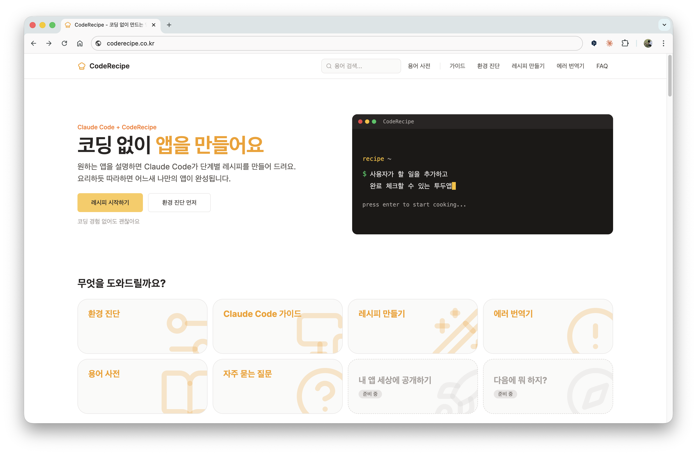
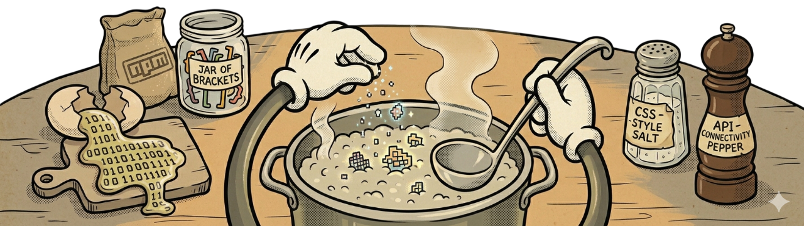

# CodeRecipe

코딩을 모르는 사람도 Claude Code로 앱을 만들 수 있도록 도와주는 서비스.

**Live:** https://coderecipe.co.kr



## 왜 만들었나

Claude Code는 강력하지만, 코딩을 모르는 사람에게는 "그래서 뭘 입력하면 되는데?"가 첫 번째 벽이다.
환경 설정, 프롬프트 작성, 에러 대응까지... 개발자에게는 당연한 것들이 비개발자에게는 진입장벽이 된다.

CodeRecipe는 그 간극을 메운다.

- 환경 설정을 단계별로 안내하고
- 질문에 답하면 프롬프트를 자동 생성해주고
- 에러가 나면 한국어로 번역해서 해결 방법을 알려준다

## 주요 기능

| 기능 | 설명 | 경로 |
|------|------|------|
| 환경 진단 | Node.js, Git, Claude Code 설치 여부 체크 + 가이드 | `/setup` |
| Claude Code 가이드 | 처음 쓰는 사람을 위한 단계별 사용법 | `/guide` |
| 레시피 만들기 | 질문에 답하면 Claude Code 프롬프트 자동 생성 | `/builder` |
| 에러 번역기 | 영어 에러 메시지를 한국어로 번역 + 해결 방법 제시 | `/error-translator` |
| 용어 사전 | 코딩 용어를 비개발자 눈높이로 설명 | `/glossary` |
| FAQ | 자주 묻는 질문 모음 | `/faq` |

## 기술 스택

| 영역 | 기술 |
|------|------|
| Framework | Next.js 14 (App Router, Static Export) |
| Language | TypeScript |
| Styling | Tailwind CSS |
| UI | Radix UI, Lucide Icons, shadcn/ui |
| Monorepo | pnpm Workspaces |
| Deploy | GitHub Pages (GitHub Actions) |
| MCP Plugin | `@coderecipe/mcp-plugin` (Claude Code 연동) |

## 프로젝트 구조

```
coderecipe/
├── apps/
│   └── web/                  # Next.js 웹앱
│       └── src/
│           ├── app/          # 페이지 (setup, guide, builder, ...)
│           └── components/   # UI 컴포넌트
├── packages/
│   ├── shared/               # 공유 로직 (에러 패턴, 프롬프트 빌더)
│   └── mcp-plugin/           # Claude Code MCP 플러그인
└── pnpm-workspace.yaml
```

## 로컬 실행

```bash
# 의존성 설치
pnpm install

# 개발 서버 실행
pnpm dev
# → http://localhost:3000/coderecipe/
```

Node.js 20+, pnpm 9+ 필요.

## 만든 사람

**Seeun** — [GitHub](https://github.com/chappse6)

Built with Claude Code.



